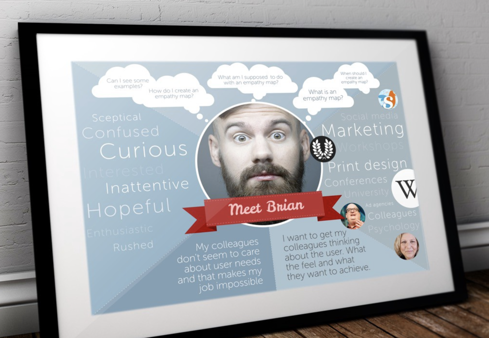

- Empathy Map
	- 
	- Guide by UXBooth
		- _Step 1: Establish Focus and Goals_
		- **Who is the person for the map?**
			- This is the user who you want to understand and empathize with. Summarize his or her situation and role. If you have multiple personas, each one will need their own map.
		- **What is the desired outcome?**
			- This is what you hope the user will do. What does success look like? For example, what does he or she need to do differently or decide? While the exercise is about building empathy and not selling or designing anything, answering this question helps focus participants and set context for the activity.
		- _Step 2: Capture the Outside World_
		- **What does she SEE?**
			- What is she encountering in her daily experiences? These could be people, their activities, or things.
			- What are the people around her doing? What is she watching, reading, and exposed to in her environment or the marketplace that could influence her? Consider alternative products and services or something the competition is doing.
			- Remember this is her world, not yours, so don’t assume that your company or product is commanding her attention. Even if your email newsletter is fantastic so are the other 20 in her inbox.
		- **What does she DO and SAY?**
			- What are her behaviours and how does she conduct herself? What is her attitude and what does she say?
			- This may change depending on where she is, who she is with, or is nearby. Attitude can be actions towards others or how she conveys something. If applicable, note how her behaviour has changed recently or changes in a public versus private settings. For example, she used to constantly post on Facebook until she told everyone that it was evil. Now she secretly uses it and stalks but doesn’t post.
		- **What does she HEAR?**
			- What is the user hearing and how is it influencing her? Consider personal connections with family, friends, and coworkers along wth what is being said in the media by bloggers, social media influencers, and experts in fields. Focus on things that impact her thinking—not superfluous information streams. Influencers should focus on the people, things, or places that influence how the user acts. Skip the Beyoncé chatter.
		- _Step 3: Explore Inside the Mind_
			- After completing the outside elements, the focus moves inside the mind to explore the thoughts and feelings that are internal to the user and not observable. _These might be inferred, guessed, or captured in direct quotes during research._ This is the central point of the exercise, as teams imagine what it is like to be in someone else’s head.
		- **What does she THINK and FEEL?**
			- What matters to the user that she is thinking about it? Consider positive and negative sides of thoughts. What makes her feel good or bad? _What does she worry about or what keeps her up at night?_ Her mind is exploring paths and possibilities as she considers doing or trying something. How does she feel? Frightened? Excited? Anxious?
		- {:height 589, :width 567}
		- Next, explore the specifics of her pains and gains. **What does success and failure look like?**
			- Capture frustrations and challenges, the obstacles that stand in her way.
			- What goals and dreams does she have? Gains are what she aspires to achieve or have.
		- When all the sections are complete, take a moment to reflect. Have participants share their thoughts on the experience. Ask how it changed their perspectives or if it produced new insights. Capture conclusions and ideas the team generated
			- 